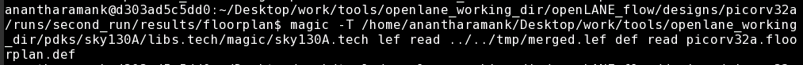

# OpenLANE-Workshop
The workshop on SoC design planning in Openlane flow using the latest Google-SkyWater 130nm process node.

 

  

  <h3 align="center">Advanced Physical Design - OpenLANE Workshop</h3>

<!-- TABLE OF CONTENTS -->

  
Table of Contents

  <ol>
    <li>
      <a href="#about-the-project">About The Project</a>
    </li>
     <li>
      <a href="#day-1-introduction-to-physical-design-flow-and-open-source-eda">Day 1 Introduction to Physical Design Flow and Open Source EDA </a>
      <ul>
        <li><a href="#rtl-to-gdsii-process">RTL to GDSII Process</a></li>
        <li><a href="#openlane-asic-flow">OpenLANE ASIC Flow</a></li>
        <li><a href="#skywater-files">Skywater Files</a></li>
        <li><a href="#design-preparation">Design preparation</a></li>
        <li><a href="#synthesis">Synthesis</a></li>
      </ul>
    </li> 
    <li>
      <a href="#day-2-floorplanning-and-standard-cells">Day 2 Floorplanning and Standard Cells</a>
      <ul>
        <li><a href="#height-and-width">Height and Width</a></li>
        <li><a href="#preplaced-cells">Preplaced Cells</a></li>
        <li><a href="#decoupling-capacitors">Decoupling Capacitors</a></li>
        <li><a href="#power-planning">Power Planning</a></li>
        <li><a href="#pin-placement">Pin Placement</a></li>
        <li><a href="#floorplan-in-eda">Floorplan in EDA</a></li>
        <li><a href="#placement-in-eda">Placement in EDA</a></li>
        <li><a href="#standard-cell-design-flow">Standard Cell Design Flow</a></li>
        <li><a href="#standard-cell-characterization">Standard Cell Characterization</a></li>
      </ul>
    </li>
        <li>
      <a href="#day-3-designing-of-a-library-cell">Day 3 - Designing of a Library Cell</a>
      <ul>
        <li><a href="#voltage-transfer-characteristics-spice-simulations">Voltage Transfer Characteristics Spice Simulations</a></li>
        <li><a href="#16-mask-cmos-process-steps">16-Mask CMOS Process Steps</a></li>
        <li><a href="#standard-cell-in-magic-tool">Standard Cell in Magic Tool</a></li>
        <li><a href="#pex-extraction-in-magic">PEX Extraction in Magic</a></li>
        <li><a href="#spice-wrapper-for-simulation">Spice Wrapper for Simulation</a></li>
      </ul>
    </li>
        <li>
      <a href="#day-4-cts-and-timing-analysis">Day 4 CTS and Timing Analysis</a>
      <ul>
        <li><a href="#lef-files-and-pin-placement">LEF Files and Pin Placement</a></li>
        <li><a href="#lef-generation-in-magic">LEF Generation in Magic</a></li>
        <li><a href="#custom-cells-in-openlane-flow">Custom Cells in OpenLANE Flow</a></li>
        <li><a href="#fixing-timing-violations">Fixing Timing Violations</a></li>
        <li><a href="#clock-tree-synthesis">Clock Tree Synthesis</a></li>
        <li><a href="#post-cts-sta-analysis">Post-CTS STA Analysis</a></li>
      </ul>
    </li>
  </ol>

  
<!-- ABOUT THE PROJECT -->
## About The Project

This project gives an interactive tutorial of OpenLANE Flow using the latest Google-SkyWater 130nm process node which is conducted by VSD-IAT.

OpenLANE is an automated RTL to GDSII flow based on several components including OpenROAD, Yosys, Magic, Netgen, Fault, OpenPhySyn, SPEF-Extractor and custom methodology scripts for design exploration and optimization. It is a tool started for true open source tape-out experience and comes with APACHE version 2.0 . The goal of OpenLANE is to produce clean GDSII without any human intervention. OpenLANE is tuned for Skywater 130nm open-source PDK and can be used to produce hard macros and chips.

<!-- Day 1 Introduction to Physical Design Flow and Open Source EDA -->
## Day 1 Introduction to Physical Design Flow and Open Source EDA

### RTL to GDSII Process

Very large-scale integration (VLSI) is the process of creating an integrated circuit (IC) by combining millions of MOS transistors onto a single chip. Very-large-scale integration (VLSI) is the process of creating an integrated circuit (IC) by combining millions of MOS transistors onto a single chip. There are many difficulties in creating the chip which now consists of billions of transistors. For creating a function-able chip, they do many design and verification process to analyse and create a function-able chip. 
These design and verification stages are broadly classified into two steps. One in Front End Design and another one is Back-end design. Front end Design starts with the design specification and ends in RTL Design and verification. Back end design starts with Synthesis and goes till Fabrication.

In this Project, we will cover a part of Back end design flow steps starting from Synthesis and goes till Routing.

One of two design methods may be employed while creating the HDL of a microarchitecture.
  - RTL Design
  - Behavioral Modeling

RTL (Register Transfer Level) is used to create high-level representations of a circuit using Verilog and/or VHDL.  EDA tools will use the HDL to perform mapping of higher-level components to the transistor level needed for physical implementation.
Behavioral Modeling – Allows the microarchitecture modeling to be performed with behavior-based modeling in HDL. This method bridges the gap between C and HDL allowing HDL design to be performed.

RTL Verification - Behavioral verification of design will be performed using testbenches.

Synthesis is a process which converts RTL to a circuit out of components from the cell library. Synthesis will do three important steps which are Translation, optimization and mapping. Post-Synthesis STA Analysis is performed on different path groups.

Partition process is converting the complex system into smaller sub-systems. For chip-level Implementation, Partition is needed and for block-level implementation, it is already performed and necessary data is given for the flow.

Floorplanning is the process of placing blocks/macros in the chip/core area. Dimensions, Pin locations and Rows definition are defined in this process. 
 
Power planning is the process of creating the power mesh which is used to connect power pins to all components in the circuit.

Placement is the process which will place the cells on the floorplan rows. 

Clock Tree Synthesis is the process of creating a clock distribution network to deliver the clock to all sequential elements.

Routing is the process which will create routing guides to implement the actual wiring.

### OpenLANE ASIC FLOW

OpenLANE flow performs full ASIC implementation steps from RTL all the way down to GDSII.OpenLANE flow consists of several stages which again consists of multiple sub-stages. 
It is started as an Open-source flow for a true open source tape-out experiment. It has two modes of Operation Interactive and Autonomous. It has Design Space Exploration which will find the best set of flow configuration from a large number of designs. Design exploration Utility is also used for regression testing. DFT is used for Scan insertion, Test pattern compaction, ATPG, etc.,. Physical Implementation is also called Automated PnR. Logic Equivalence Check is used to formally confirm that the function didn't change after modifying the netlist.

The tools and flow which are used in the openlane Flow for the process is mentioned below.

1. Synthesis
  - yosys - Performs RTL synthesis
  - abc - Performs technology mapping
  - OpenSTA - Pefroms static timing analysis on the resulting netlist to generate timing reports
  
2. Floorplan and PDN
  - init_fp - Defines the core area for the macro as well as the rows (used for placement) and the tracks (used for routing)
  - ioplacer - Places the macro input and output ports
  - pdn - Generates the power distribution network
  - tapcell - Inserts welltap and decap cells in the floorplan
  
3. Placement
  - RePLace - Performs global placement
  - Resizer - Performs optional optimizations on the design
  - OpenPhySyn - Performs timing optimizations on the design
  - OpenDP - Perfroms detailed placement to legalize the globally placed components
  
4. CTS
  - TritonCTS - Synthesizes the clock distribution network (clock tree)
  
5. Routing 
  - FastRoute - Performs global routing to generate a guide file for the detailed router
  - TritonRoute - Performs detailed routing
  - SPEF-Extractor - Performs SPEF extraction
  
6. GDSII Generation
  - Magic - Streams out the final GDSII layout file from the routed def
  
7. Checks
  - Magic - Performs DRC Checks & Antenna Checks
  - Netgen - Performs LVS Checks

### Skywater Files

The SkyWater Open Source PDK is a collaboration between Google and SkyWater Technology Foundry to provide a fully open source Process Design Kit and related resources, which can be used to create manufacturable designs at SkyWater’s facility.
Process Design Kit (PDK) which is a collection of files used to model a fabrication process for the EDA tools to produce an IP.

The Skywater PDK files we are working with are described under ~/PDKS. There are three subdirectories needed for the workshop:
  -  Skywater-pdk – PDK which are related to foundary.
  -  Open_pdks – Contains scripts that are used to bridge the gap between closed-source and open-source PDK to EDA tool compatibility
  -  Sky130A – PDK files which are open-source compatible.
  
  
  
Inside Sky130A there will be two files which are related to process specific files and tool specific files

libs.ref Contains process specific files 
  - (EX:) sky130_fd_sc_hd ; sky130 represent process name, fd represent foundary name (skywater) , sc represent for standard cell, hd represent for high density.
  

libs.tech Contains files specific to tools such as Magic, ngspice etc.,.

### Design preparation

Before starting the flow we have to check required inputs are placed in the respective folder to run properly. All the designs are placed under ~/openlane_flow_designs/. We have to check the /designs folder to get the required block for our flow. Within the Chosen design we can see the source files and configuration files.

Source files (/src folder) will contain verilog files and sdc constraint files. Configuration files contain design's configuration file for running the flow. 

<h3 align="center">config.tcl</h3>

### Synthesis

The flow will start with synthesis. 

./flow.tcl -interactive is the script which runs the OpenLANE flow and we will do it in interactive move.

Different software dependencies are needed to run OpenLANE. To import these we need to run: pacakage require openlane 0.9.

prep -design <design_name> -tag <run_name> is used to make file structure for our design.

This command merges the cell LEF and technology LEF information and name it as merged.lef. 

After running this look in the ~/design/picorv32a folder and you will see runs folder being created.

To run synthesis type %run_synthesis.

To run synthesis we will use the Yosys software.

<!-- Day 2 Floorplanning and Standard Cells -->
## Day 2 Floorplanning and Standard Cells

### Height and Width

The dimensions of the core and die will give us the details about Utilization and Aspect ration. 
Utilization Factor will give the amount of area which is occupied by the cells specifies in the netlist. Utilization Factor is calculated as (occupied cells area)/ total core area.
Aspect Ration will give us the shape of the chip. Aspect ratio is calculated as the ratio of the height of the core to the width of the core. 

### Preplaced Cells

The functionality of these cells is already placed in the core area by the top-level designer. The arrangement of these IP's in a chip is referred to as Floorplanning. These IP's / blocks have user-defined locations and hence it is placed in chip before automated PnR are called pre-placed cells. Automated PnR will places the remaining logic cells in the design onto the chip. 

### Decoupling Capacitors

Due to logic physical Distance from main power supply to any circuit, we can't guarantee that logic 1/0 obtained in that logic. So we will use Decoupling capacitors.  
Decoupling Capacitor will be filled with charges. When the circuit switches, it gets power from the Decoupling capacitors.  Since it will be placed close to that circuit, it will have hardly any voltage drop. 

### Power Planning

Power planning means to provide power to every macros, standard cells, and all other cells are present in the design. Power and Ground nets are usually laid out on the metal layers. This step will create crosstalk which will disrupt the signals flowing in the layers.

### Pin Placement

The goal of pin placement is to use the connectivity information of the HDL netlist to determine where along the I/O ring a specific pin should be placed. Clock port will be bigger than the data port. Block the area with blockage so that automated PnR doesn't place the cell in the particular area. That area will be reserved for pin location. 

### Floorplan in EDA

To run the Floorplan use the following command : 

Reports after completion of Floorplan: 

To open the floorplan in Magic tool use the following command: 

`magic -T <magic tech file> lef read <lef file> def read <def file>`
  

The Magic tool will show the floorplan for the given design: 

### Placement in EDA

This step will bind the netlist with the physical cells. Netlist will give physical values to the cells. OpenLANE will do the placement in two stages. Global placement and Detailed Placement. 
Global placement - the course placement i.e., approximate location for each cell is done. The reduction of HPWL is the main focus. Half Parameter Wire Length (HPWL) is used to reduce the wire length.
Detailed Placement  - Standard cells are placed in Standard cell rows. It can be abutted but it will not do overlap of cells. Legalization is done which is useful in a reduction in timing violations.

To run the placement use the following command :

Reports after completion of Placement: 

To open the Placement in Magic tool use the following command: 

`magic -T <magic tech file> lef read <lef file> def read <def file>`
  

The Magic tool will show the Placement for the given design: 

### Standard Cell Design Flow

Standard cell design is divided into three categories: 
  1. Inputs
  2. Design Steps
  3. Outputs

<li>Inputs -  DRC & LVS rules, SPICE Models, Library& User defined Specs.</li>
<li>Design Steps - Circuit Design, Layout Design, Characterization.</li>
<li>Outputs - Circuit description language (CDL), GDSII, LEF, Extracted spice netlist (.cir) </li>

### Standard Cell Characterization

The open-source software GUNA is used for characterization. Characterization is a well-defined flow consisting of the following steps:
  1. Reading the model.
  2. Read Extracted SPICE Netlist.
  3. Recognize behaviour os the cell.
  4. Read the subcircuit of the design.
  5. Attach necessary power sources.
  6. Attach Stimulus.
  7. Provide Necessary Capacitance.
  8. Provide necessary simulation commands.
  
<!-- Day 3 Designing of a Library Cell -->
## Day 3 Designing of a Library Cell

### Voltage Transfer Characteristics Spice Simulations

The SPICE deck formation consists of component connectivity, component values, Identifying the Nodes. In this Substrate, W/L values have to be mentioned. Input voltage will mostly be the multiple of L. 

To do the SPICE waveform in the ngspice follow the steps below:
  1. Open the location.
  2. Source `<name>.cir`
  3. use `run` command
  4. Use `subplot` command
    When you subplot, you will see type of plot.
  5. type `dc1` (since it is mentioned here)
  6. type `display` 
  7. type `plot out vs in` to see the waveform.
  
  

### 16-Mask CMOS Process Steps

Following steps are followed for the formation of 16-Mask CMOS Process:

  1. Select a Substrate
  2. Create Active region for transmission
  3. N-Well & P-Well formation
  4. Formation of a Gate
  5. Lightly Doped Drain (LDD) Formation
  6. Source & Drain Formation
  7. Formation of Contacts & Interconnects
  8. Higher Level Metal Formation 

### Standard Cell in Magic Tool

Refer to: https://github.com/nickson-jose/vsdstdcelldesign for cell files.

We are going to add custom cell in our design. we will add the cell which is already been developed. 

To invoke Magic:

  
  
  

### PEX Extraction in Magic

To extract the parasitic spice file for the associated layout one needs to create an extraction file. After generating the extracted file we need to output the .ext file to a spice file:

  
  
The extracted SPICE 

  

### Spice Wrapper for Simulation

To  invoke the ngspice tool : `ngspice sky130_inv.spice`

The waveform which is generated by plotting : `plot y vs time a`

<!-- Day 4 CTS and Timing Analysis -->
## Day 4 CTS and Timing Analysis

### LEF Files and Pin Placement

Library Exchange Format (LEF) is a specification for representing the physical layout of an integrated circuit. It includes design rules (Tech LEF) and abstract information (Cell LEF) about the cells. 

On-track standard cell pin placement is essential for DRC free PnR flow. 

  

### LEF Generation in Magic

Magic allows users to generate cell LEF information directly from the Magic terminal. To generate the cell LEF file from Magic perform: `lef write`

  
  
The LEF file is created 

  
  
Content of generated LEF:

  
  
### Custom Cells in OpenLANE Flow

After we extracted the LEF information we can add our custom cell into our OpenLANE Flow. OpenLANE flow will allow the user to add custom cells on the fly. In order to include the new cells in OpenLANE we need to do some initial configuration:

  1.  characterize the new cell with specified corners using GUNA tool.
  2.  Include cell level liberty file in top level liberty file
  3.  Reconfigure synthesis switches in the config.tcl file by adding the corner which is added to the custom cell:
  
   
   
Note: This step will also include any extra LEF files generated for the custom standard cell(s). 

  4. Overwrite the run to add the new configuration files to the flow.
  5. Add additional LEFs to the file by
  
    `set lef [glob $::env(DESIGN_DIR)/src/*.lef]`
    
    `add_lefs -src $lefs`
    
 Custom Cell is added in the flow. The below diagram shows the custom cell addition in the design
 
   
    
### Fixing Timing Violations

There are two violations we have to fix in a design. One is Setup and another one is hold. Since there won't any clock tree till now we have to focus on fixing Setup time violations. Setup violations can be fixed in many ways like reducing the amount of delay in the data path, upsizing the cells, VT swapping etc. We will do Setup violation fixing by upsizing the buffer. 

   
   
### Clock Tree Synthesis   

Clock Tree is the distribution of the clock to the sequential circuits. Specialized Clock buffers are used for the clock tree which has the same rise and fall delay. There are many types of clock tree available H-Tree, X-Tree etc.  The clock tree is created which you can see the below figure 

   
   
### Post-CTS STA Analysis

We will use the OpenROAD flow since it has the OpenSTA software build in it. We will perform STA analysis in  OpenLANE flow by invoking OpenROAD. Since it is constrained for only one corner in the tool we have to check the specified corner only. In our flow, we will use the only typical corner.

Use the following commands for post-cts STA analysis

  `openroad`
  
  `read_lef <lef_location>`
  
  `read_def <def_location>`
  
  `write_db <db_location>`
  
  `read_db <db_location>`
  
  `read_verilog <verilog_location>`
  
  `read_liberty <liberty_location>`
  
  `read_sdc <sdc_location>`
  
  `set_propagated_clock [all_clocks]`
  
  `report_checks -path_delay nim_max -format full_clock_expanded -digits 4`
  

